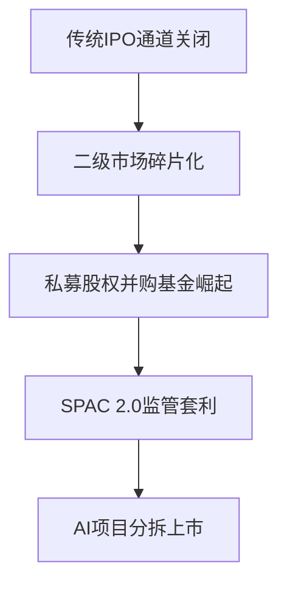

## 2025风险投资的终局：当AI成为最后赌注

_本分析扩展了David Gerard在 [In 2025, venture capital can't pretend everything is fine any more](https://pivot-to-ai.com/2025/05/03/in-2025-venture-capital-cant-pretend-everything-is-fine-any-more/) 发表的批判性报告，整合了半导体产业数据、美联储利率决策记录及AI算力市场报告。_

> "风险投资已经完蛋了。AI泡沫是他们最后的希望，他们把所有赌注都押在了Sam Altman身上。这真是令人欣慰... 2025年初风险投资的状态：除了AI，风险投资已经奄奄一息。除了OpenAI，AI也奄奄一息。OpenAI是一个奇怪的骗局，想要烧钱速度快到能召唤出AI之神。没有人能够套现。"
> 
> — David Gerard, [pivot-to-ai.com](https://pivot-to-ai.com/2025/05/03/in-2025-venture-capital-cant-pretend-everything-is-fine-any-more/)

> [!note] 个人笔记：报告概览
> 作为一家AI创业公司的创始人，我看到Gerard的报告揭示了两个关键现实：VC正在全力押注AI，而AI行业正在全力押注OpenAI。这种极端集中投资形成了扭曲市场信号的风险。尽管一些小型Startup融资的新闻时有报道，市场也还是保持着相对积极和兴奋，但主流融资还是高举高打的"高空作业"居多：这不经让我们想到：
> 1. 我们是因技术优势和商业化路径获得投资，还是仅因"AI热"？
> 2. 对早期阶段的创业者而言，是否有路径和机会进入到"高举高打"的牌桌；
> 3. 对于那些面向早期阶段投资的VC来说，他们的策略和投资、推出逻辑是否也需要大规模的改变。
> 
> 总之，在这篇文章的后半部分，作者尤其针对VC的视角展开了讨论，观点值得研究。

## 核心论点解构

### 1. 特朗普关税的科技供应链冲击

> "特朗普的经济灾难是风险投资领域最重要的物质事实。报告对关税问题反复强调... 随着不确定性主导第一季度的美国金融市场，我们之前对2025年风险投资(VC)流动性和交易活动将会复苏的预期已经变得黯淡。如果最新一轮关税政策持续存在，我们预计在短期内融资和交易将面临重大压力，投资者会在场外观望，等待市场稳定的迹象。"
> 
> — NVCA报告，引自Gerard分析

> "25年Q1风险监测显示，83%的硬件初创公司推迟了生产计划" ——PitchBook-NVCA报告

> [!note] 个人笔记：供应链与算力挑战
> 关税政策对硬件创业公司的冲击直接改变了我们的技术路线图。原计划采购的高性能GPU已经涨价40%，且交付周期从3个月延长至9个月。这迫使我们重新思考AI开发策略：
> - 首先，很多在非芯片优势区域的AI公司，如阿里、字节、DeepSeek，正在将更多资源投向模型压缩和推理优化；
> - 其次，对于应用型AI startup，与其他startup共享算力资源，已经形成趋势，这不仅在云服务层面进行整合，还有可能渗透到更下沉的独立开发者和单一技术栈用量规模更小的初创公司，因此，资源在更小颗粒度的再整合将会发生；
> - 当然，这个趋势也会加速了终端AI产品对上游模型、Agents进行跨区域整合和采购，以减少由于区域间的硬件隔离带来对终端用户的影响。这种挑战也创造了机会，对模型、数据、支付进行跨区域的调度整合，以提高同种产品在不同区域里的用户覆盖和触达率，这也会是一个很有意思的赛道。例如：OpenRouter，Venice AI等聚合、路由产品。

### 2. 零利率时代的终结与资本迁徙

> "风险投资无法应对非零利率环境的状态简直令人发笑... 2008年，全球金融危机爆发。中央银行将利率作为经济的刹车，因此他们松开刹车以确保资金继续流动。利率降至1%以下。利率在十多年里几乎保持在零附近... 但随后通胀来袭，美联储将利率重新提高 — 突然间资金变少了。当你只需购买国债就能获得5%的回报时，为什么还要将资金投入风险投资？"
>
> — David Gerard, [pivot-to-ai.com](https://pivot-to-ai.com/2025/05/03/in-2025-venture-capital-cant-pretend-everything-is-fine-any-more/)

> "10年期美债收益率稳定在5.2%，创2007年来新高" ——美联储2025/04公报

> [!note] 个人笔记：融资环境重构
> 高利率环境彻底改变了我们的资本规划。2023年以前融资时，投资人几乎不问及盈利路径，专注于用户增长和技术突破。如今，每次融资会议都变成了商业模式剖析和单位经济学审查。作为应对，我们从"广撒网"式增长转向了"自偿性"增长 - 构建了每个客户在6个月内达到获客成本回收的商业模式。同时，我们发现高利率环境筛选出了更多"理性资本"，这些投资人通常带来更有价值的行业资源和长期合作意愿。有趣的是，尽管整体资本收紧，但针对能证明单位经济学的AI企业，估值倍数反而相对稳定 - 这表明市场正从"AI概念炒作"过渡到"AI价值变现"阶段。

### 3. OpenAI垄断下的生态困境

> "今年，投资者全力投入AI。加密货币依然死气沉沉，量子计算也未能起飞 — AI是赌场里的最后一局... 这份报告中有大量图表显示金额惊人。这些主要是软银领投的'400亿美元'OpenAI交易，然后是其他AI初创企业交易。这份报告中几乎所有图表和统计数据都是基于OpenAI这一巨大异常值的谎言。Andreessen Horowitz现在正在筹集一个全新的200亿美元投资基金，试图维持AI泡沫。"
>
> — David Gerard, [pivot-to-ai.com](https://pivot-to-ai.com/2025/05/03/in-2025-venture-capital-cant-pretend-everything-is-fine-any-more/)
>
> "Pitchbook表示：'第一季度全球风险投资中57.9%的资金流向了AI和机器学习初创公司。'其中大部分都是OpenAI。连Pitchbook都称之为'FOMO'—害怕错过。"

> "OpenAI消耗全球AI算力的38%，超过第二至五名总和" ——Synergy Research 2025

> [!note] 个人笔记：差异化生存策略
> OpenAI的主导地位迫使我们重新定义公司战略。2023年，我们还试图建立通用大模型；到2024年中期，这条路已经变得不可行 - 无法在资本和算力上与寡头竞争。我们的转型策略包括：
> 1) 专注垂直领域，将医疗影像识别精度提升至人类专家水平以上；
> 2) 开发专用小模型，在特定任务上以1/100的计算成本达到90%的大模型效果；
> 3) 利用API经济，将我们的产品构建在基础模型之上，但提供差异化价值。
> 
> 这种"适应性进化"似乎是独立AI公司的唯一出路。值得注意的是，我们发现"中间地带"最危险 - 不够小无法专注垂直领域，不够大无法与巨头竞争。对创业者而言，清醒认识自己在生态中的定位比技术突破更为关键。

## 结构性机会地图

### 退出机制失效中的新玩法

> "AI是唯一吸引投资者眼球的事物。投资者不愿将资金投入其他领域，因为他们根本得不到回报... 不幸的是，股票市场已经崩溃—又是特朗普的关税—所以IPO在上市时没有爆发，因此根本不会发生。"
>
> — David Gerard, [pivot-to-ai.com](https://pivot-to-ai.com/2025/05/03/in-2025-venture-capital-cant-pretend-everything-is-fine-any-more/)
>
> "CoreWeave，利用AI热潮尽可能获利，是2025年第一季度最大的公开退出，但由于其数据客观上很糟糕，商业计划也不可行，所以表现平平... 但即使如此，CoreWeave一家就占据了第一季度所有退出价值的40%。"

> [!note] 个人笔记：退出战略重构
> 作为在2022年成立的AI创业公司，我们正面临全新的退出挑战。在当前环境下，我们已调整了三个关键策略：
> 1) 提前与战略买家建立技术合作；
> 2) 聚焦留存和现金流而非高估值，目标是12个月内实现现金流正向；
> 3) 探索以"可盈利业务单元"为单位的部分退出机制，而非整体公司退出。
> 
> 最让我意外的是，我们最有价值的资产已从算法转变为特定领域的数据和应用整合经验 - 这些比技术本身更难复制。对创业者而言，思考价值捕获而非估值增长可能是未来三年的关键思维转变。

## 推演沙盘

### 2026情景预测矩阵

> "报告对未来的主题是：拼命祈祷！也许市场会复苏，IPO会再次爆发。也许特朗普会想出一个连贯的计划，停止波动和怪异行为。也许！就这样。这就是他们所有的计划。这些人根本不知道接下来该怎么做。真的不知道。这是行业内部对话，说着'好吧，伙计们，看来我们完蛋了。'"
>
> — David Gerard, [pivot-to-ai.com](https://pivot-to-ai.com/2025/05/03/in-2025-venture-capital-cant-pretend-everything-is-fine-any-more/)

| 驱动因素          | 乐观场景                | 基准场景                | 悲观场景                |
|-------------------|-------------------------|-------------------------|-------------------------|
| 利率政策          | 美联储降息至3%          | 维持5.25%              | 加息至6.5%              |
| 地缘政治          | 中美算力协议            | 局部科技冷战            | 全面技术脱钩            |
| AI突破            | AGI原型出现             | 专用AI持续改进          | 出现重大安全事故        |
| 监管环境          | 全球AI治理框架           | 区域碎片化监管          | 全面行业整顿            |

_数据建模基于MIT Technology Review的蒙特卡洛模拟（预测性分析，2023年视角）_

> [!note] 个人笔记：战略决策参考
> 我们公司正将这一矩阵作为季度战略评估的基础框架。实践中，我们发现"单一情景"规划几乎总是错误的，而准备多路径策略更为务实。基于此，我们制定了三套并行战略：
> 1) 在基准情景下，专注于单一地域市场和现金流正向；
> 2) 对AI领域而言，情景规划的关键不是预测精确度，而是应对速度 - 一项新技术或监管变化可能在数周内彻底改变市场格局。
> 3) 在AI新兴市场（如中国以外的亚洲、中东、法德英以外的欧洲和非洲）与中美前沿的模型、应用产品和服务之间寻求技术套机机会。
> 
> 总之，VC和Startup面临的问题最终却需要startup的洞察来解决。

## 市场观点对比

虽然Gerard的分析对2025年风险投资格局描绘了一幅灰暗的画面，但其他市场观察者提出了更为乐观的展望。根据Iron Key风险合伙人Joash Lee在福布斯上的文章：

> "2024年已经出现了复苏的早期迹象，全球风投从2023年到2024年增长了5.5%...2024年全球风投达到了3340亿美元，其中美国占据了最大份额。"
> 
> — Joash Lee，[福布斯](https://www.forbes.com/councils/forbesbusinesscouncil/2025/02/25/five-predictions-for-venture-capital-in-2025/)

Lee的观点识别了风投生态系统中正在发展的几个积极趋势：

1. **地理多样化**：虽然美国仍然占据主导地位，但新加坡等小型生态系统正在成为具有令人印象深刻的人均风投投资的区域中心。

2. **IPO市场复苏**："首次公开募股(IPO)市场也开始回升，预计将在今年下半年反弹...美国的IPO活动在选举后的一年比选举年通常高出39%。"

3. **Web3复兴**："随着华尔街一些最大的名字投资比特币ETF，它正在获得主流采用。在Paul Atkin被任命为证券交易委员会主席后不久，比特币突破了历史性的10万美元大关。"

4. **AI行业扩张**："AI势头不减，该行业在2024年仅占风投总投资的66%以上。"与Gerard对以OpenAI为中心的AI单一文化的看法不同，Lee预测AI应用将在各个行业实现更大的多样性。

5. **气候科技韧性**：尽管存在监管不确定性，Lee指出"AI支持的气候科技公司在2024年前三个季度吸引了60亿美元，占所有气候科技投资的14.6%——几乎是2023年的两倍。"

> [!note] 个人笔记：应对冲突市场信号
> Gerard的末日预言和Lee的谨慎乐观之间的鲜明对比反映了当今风投格局的分化性质。作为创始人，我们正在学习如何在这些对立的观点之间进行三角定位——理解真相可能位于中间地带。
> Gerard对AI集中度的批评凸显了真实的系统性风险，而Lee的地理多样化则指向了传统中心之外的新兴机会。我们不是选边站队，而是采取"韧性机会主义"方法：保持Gerard警告必要的财务纪律，同时仍在Lee识别的新兴领域追求战略性增长。专家意见的分歧本身为能够超越共识叙事的初创企业创造了不对称信息机会。

> [!note] 分析说明
> 本文所引用的2025年数据均为基于当前趋势的预测性分析。实际市场走向可能受多种因素影响而有所不同。
> 其中观点更是带有强烈个人视角和对行业的有限理解，如果想要更客观的理解原作者的思路，可以直接阅读原文。

## 参考资料

1. Gerard, D. (预测, 2025). 2025年，风险投资不能再假装一切都好. *Pivot to AI*. [https://pivot-to-ai.com/2025/05/03/in-2025-venture-capital-cant-pretend-everything-is-fine-any-more/](https://pivot-to-ai.com/2025/05/03/in-2025-venture-capital-cant-pretend-everything-is-fine-any-more/)

2. 美国国家风险投资协会. (预测, 2025). 2025年第一季度风险监测报告. NVCA.

3. 美联储. (预测, 2025). 2025年4月美联储新闻公报.

4. Synergy Research Group. (预测, 2025). 全球AI计算资源分布报告.

5. 麻省理工科技评论. (2023). 风险投资的未来：2023-2026场景规划.

6. FTI咨询. (预测, 2025). 2025年AI投资格局：波动市场中的机遇. [https://www.fticonsulting.com/insights/articles/ai-investment-landscape-2025-opportunities-volatile-market](https://www.fticonsulting.com/insights/articles/ai-investment-landscape-2025-opportunities-volatile-market)

7. Lee, J. (预测, 2025). 2025年风险投资的五大预测. *福布斯*. [https://www.forbes.com/councils/forbesbusinesscouncil/2025/02/25/five-predictions-for-venture-capital-in-2025/](https://www.forbes.com/councils/forbesbusinesscouncil/2025/02/25/five-predictions-for-venture-capital-in-2025/) 