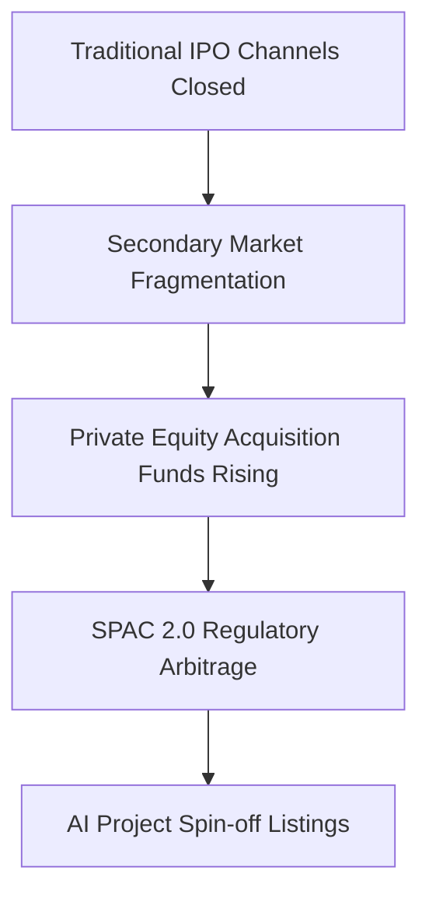

## The End Game of Venture Capital in 2025: When AI Becomes the Last Bet

_This analysis expands on the critical report published by David Gerard at [In 2025, venture capital can't pretend everything is fine any more](https://pivot-to-ai.com/2025/05/03/in-2025-venture-capital-cant-pretend-everything-is-fine-any-more/), integrating semiconductor industry data, Federal Reserve rate decision records, and AI computing market reports._

> "Venture capital is screwed. A bubble in AI is their last hope, and they're betting everything on Sam Altman. It's heartwarming... Here is the state of venture capital in early 2025: Venture capital is moribund except AI. AI is moribund except OpenAI. OpenAI is a weird scam that wants to burn money so fast it summons AI God. Nobody can cash out."
> 
> — David Gerard, [pivot-to-ai.com](https://pivot-to-ai.com/2025/05/03/in-2025-venture-capital-cant-pretend-everything-is-fine-any-more/)

> [!note] Personal Notes: Report Overview
> As a founder of an AI startup, I see Gerard's report revealing two key realities: VCs are going all-in on AI, while the AI industry is going all-in on OpenAI. This extreme concentration of investment creates a risk of distorted market signals. Despite occasional news of small startups securing funding and the market maintaining relative optimism and excitement, mainstream funding still predominantly favors high-stakes "high-altitude operations." This raises several questions:
> 1. Did we receive investment because of our technological advantages and commercialization path, or merely because of the "AI hype"?
> 2. For early-stage entrepreneurs, are there paths and opportunities to enter the high-stakes game?
> 3. For VCs focused on early-stage investments, do their strategy, investment logic, and exit plans also need significant transformation?
> 
> Overall, the latter part of this article particularly discusses perspectives from VCs, with viewpoints worth studying.

## Core Arguments Deconstructed

### 1. Trump Tariffs' Impact on Tech Supply Chains

> "The Trump economic disaster is the most important material fact for the venture capital sphere. The report goes on and on about the tariffs... With uncertainty dominating US financial markets throughout the first quarter, our prior expectation that 2025 would see a resurgence in venture capital (VC) liquidity and dealmaking has been dimmed. Should the latest iteration of tariffs stand, we expect significant pressure on fundraising and dealmaking in the near term as investors sit on the sidelines and wait for signs of market stabilization."
> 
> — NVCA report, cited in Gerard's analysis

> "Q1 '25 risk monitoring shows 83% of hardware startups have delayed production plans" —PitchBook-NVCA Report

> [!note] Personal Notes: Supply Chain and Computing Power Challenges
> The impact of tariff policies on hardware startups has directly changed our technology roadmap. The high-performance GPUs we originally planned to purchase have increased in price by 40%, with delivery times extended from 3 months to 9 months. This has forced us to rethink our AI development strategy:
> - First, many AI companies without chip advantages, such as Alibaba, ByteDance, and DeepSeek, are directing more resources toward model compression and inference optimization;
> - Second, sharing computing resources with other startups has become a trend, not only through cloud service integration but potentially extending to more granular levels among independent developers and early-stage startups with smaller technical stack usage. This will lead to resource re-integration at smaller granularity;
> - Of course, this trend will also accelerate cross-regional integration and procurement of upstream models and agents by terminal AI products to reduce the impact of regional hardware isolation on end users. These challenges also create opportunities for cross-regional scheduling and integration of models, data, and payments to improve user coverage and reach rates for similar products across different regions. Interesting tracks include aggregation and routing products like OpenRouter and Venice AI.

### 2. The End of the Zero Interest Rate Era and Capital Migration

> "VC is hilariously unable to cope with not being in a zero-interest-rate environment... In 2008, the global financial crisis hit. Central banks use interest rates as the brakes on an economy, so they took the brakes off to make sure money kept flowing around. Interest rates went below 1%. And interest stayed near zero for over a decade... But then inflation came along, and the Fed put interest rates back up — and suddenly there was less money. Why put money into venture capital when you could get back 5% just buying Treasury bills?"
>
> — David Gerard, [pivot-to-ai.com](https://pivot-to-ai.com/2025/05/03/in-2025-venture-capital-cant-pretend-everything-is-fine-any-more/)

> "10-year Treasury yield stable at 5.2%, highest since 2007" —Federal Reserve April 2025 Report

> [!note] Personal Notes: Financing Environment Restructuring
> The high interest rate environment has completely changed our capital planning. When raising funds before 2023, investors hardly asked about profitability paths, focusing instead on user growth and technological breakthroughs. Now, every financing meeting has turned into a business model analysis and unit economics review. In response, we've shifted from "casting a wide net" growth to "self-sustaining" growth - building a business model where each customer reaches customer acquisition cost recovery within 6 months. At the same time, we've found that the high interest rate environment has filtered out more "rational capital," these investors typically bringing more valuable industry resources and long-term partnership intentions. Interestingly, despite overall capital tightening, valuation multiples have remained relatively stable for AI companies that can demonstrate unit economics - suggesting the market is transitioning from "AI concept hype" to the "AI value realization" phase.

### 3. The Ecosystem Dilemma Under OpenAI's Monopoly

> "This year, the investors are all-in on AI. Crypto's still dead, quantum isn't taking off — AI's the last game in the casino... There's lots of graphs in this report showing healthy dollar amounts. These are mostly the '$40 billion' OpenAI deal led by Softbank, and then the other AI startup deals. Almost all the graphs and statistics in this report are lies based on the one huge OpenAI outlier. Andreessen Horowitz is right now raising a fresh $20 billion investment fund to try to keep the AI bubble going."
>
> — David Gerard, [pivot-to-ai.com](https://pivot-to-ai.com/2025/05/03/in-2025-venture-capital-cant-pretend-everything-is-fine-any-more/)
>
> "Pitchbook says: '57.9% of global VC dollars invested in Q1 went to AI and machine learning startups.' Most of that's OpenAI. Even Pitchbook calls it 'FOMO' — fear of missing out."

> "OpenAI consumes 38% of global AI computing power, exceeding the combined total of the 2nd to 5th ranked companies" —Synergy Research 2025

> [!note] Personal Notes: Differentiation Survival Strategy
> OpenAI's dominant position has forced us to redefine our company strategy. In 2023, we were still trying to build general large models; by mid-2024, this path had become unfeasible - unable to compete with oligopolies in capital and computing power. Our transformation strategy includes:
> 1) Focusing on vertical domains, elevating medical image recognition accuracy above human expert levels;
> 2) Developing specialized small models that achieve 90% of large model effectiveness at 1/100th the computational cost;
> 3) Leveraging the API economy, building our products on foundation models but providing differentiated value.
> 
> This "adaptive evolution" seems to be the only way out for independent AI companies. Notably, we've found the "middle ground" most dangerous - not small enough to focus on vertical domains, not large enough to compete with giants. For entrepreneurs, clearly understanding one's position in the ecosystem is more critical than technological breakthroughs.

## Structural Opportunity Map

### New Approaches in Failed Exit Mechanisms

> "AI is the only thing that's catching the eye of the investors. The investors don't want to put their money into other areas because they're just not getting payouts... Unfortunately, the stock market is broken — the Trump tariffs again — so IPOs are not popping on launch, so they're not happening."
>
> — David Gerard, [pivot-to-ai.com](https://pivot-to-ai.com/2025/05/03/in-2025-venture-capital-cant-pretend-everything-is-fine-any-more/)
>
> "CoreWeave, riding the AI buzz for all it was worth, was the big public exit in first quarter 2025, and that one fell flat because their numbers were objectively terrible and their business plan doesn't work... But even with all that, CoreWeave on its own was 40% of all first quarter exits by value."

> [!note] Personal Notes: Exit Strategy Reconstruction
> As an AI startup founded in 2022, we're facing entirely new exit challenges. In the current environment, we've adjusted three key strategies:
> 1) Establishing early technical collaboration with strategic buyers;
> 2) Focusing on retention and cash flow rather than high valuations, with the goal of achieving positive cash flow within 12 months;
> 3) Exploring partial exit mechanisms based on "profitable business units" rather than whole-company exits.
> 
> What's most surprising is that our most valuable assets have shifted from algorithms to domain-specific data and application integration experience - these are harder to replicate than the technology itself. For entrepreneurs, thinking about value capture rather than valuation growth may be the key mindset shift for the next three years.

## Scenario Planning

### 2026 Scenario Prediction Matrix

> "The report's theme for the future is: hope really hard! Maybe markets will recover and IPOs will pop again. Maybe Trump will come up with a coherent plan and stop being volatile and weird. Maybe! That's it. That's all the plan they have. These guys haven't got a clue what to do next. They really don't. This is the industry talking to itself and saying 'well gosh, chaps, looks like we're screwed.'"
>
> — David Gerard, [pivot-to-ai.com](https://pivot-to-ai.com/2025/05/03/in-2025-venture-capital-cant-pretend-everything-is-fine-any-more/)

| Driving Factor     | Optimistic Scenario     | Baseline Scenario       | Pessimistic Scenario    |
|-------------------|-------------------------|-------------------------|-------------------------|
| Interest Rate Policy | Fed cuts rates to 3%    | Maintains 5.25%         | Raises to 6.5%          |
| Geopolitics       | US-China Computing Agreement | Partial Tech Cold War  | Complete Tech Decoupling |
| AI Breakthroughs  | AGI Prototype Emerges    | Specialized AI Continues to Improve | Major Safety Incident Occurs |
| Regulatory Environment | Global AI Governance Framework | Fragmented Regional Regulations | Complete Industry Overhaul |

_Data modeling based on MIT Technology Review's Monte Carlo simulations (predictive analysis from a 2023 perspective)_

> [!note] Personal Notes: Strategic Decision Reference
> Our company is using this matrix as the foundation for quarterly strategic assessments. In practice, we've found that "single scenario" planning is almost always wrong, while preparing multi-path strategies is more practical. Based on this, we've developed three parallel strategies:
> 1) In the baseline scenario, focus on a single geographic market and positive cash flow;
> 2) For the AI field, the key to scenario planning isn't predictive accuracy but response speed - a new technology or regulatory change can completely transform the market landscape within weeks.
> 3) Seeking technological arbitrage opportunities between emerging AI markets (such as Asia outside China, Middle East, Europe outside France/Germany/UK, and Africa) and the frontier models, application products, and services from China and the US.
> 
> In conclusion, the challenges facing VCs and startups ultimately require startup insights to solve.

## Contrasting Market Perspectives

While Gerard's analysis paints a grim picture of the venture capital landscape in 2025, other market observers present a more optimistic outlook. According to Joash Lee, a venture partner at Iron Key writing for Forbes:

> "2024 saw some early signs of recovery, with global VC investments rising by 5.5% from 2023 to 2024... Global VC investments came in at a little over $334 billion in 2024, with the U.S. taking the lion's share."
> 
> — Joash Lee, [Forbes](https://www.forbes.com/councils/forbesbusinesscouncil/2025/02/25/five-predictions-for-venture-capital-in-2025/)

Lee's perspective identifies several positive trends developing in the VC ecosystem:

1. **Geographic Diversification**: While U.S. remains dominant, smaller ecosystems like Singapore are emerging as regional hubs with impressive per capita VC investment.

2. **IPO Market Recovery**: "The initial public offering (IPO) market is also starting to pick up and is expected to bounce back in the second half of the year... IPO activity in the U.S. tends to be 39% higher in post-election years compared to election years."

3. **Web3 Renaissance**: "With some of Wall Street's biggest names investing in Bitcoin ETFs, it's gaining mainstream adoption. Bitcoin crossed the historic $100,000 mark moments after Paul Atkin's appointment as the head of the Securities and Exchange Commission."

4. **AI Sector Expansion**: "AI's been on a streak, with the sector alone accounting for over 66% of total VC investments in 2024." Unlike Gerard's view of an AI monoculture centered on OpenAI, Lee predicts greater diversity in AI applications across sectors.

5. **Climate Tech Resilience**: Despite regulatory uncertainty, Lee notes that "AI-backed climate tech companies attracted $6 billion within the first three quarters of 2024, accounting for 14.6% of all climate tech investments—almost double 2023's numbers."

> [!note] Personal Notes: Navigating Conflicting Market Signals
> The stark contrast between Gerard's apocalyptic view and Lee's cautious optimism reflects the fragmented nature of today's VC landscape. As founders, we're learning to triangulate between these opposing perspectives - understanding that the truth likely lies somewhere in between.
> Gerard's critique of AI concentration highlights real systemic risks, while Lee's geographical diversification points to emerging opportunities outside traditional hubs. Rather than picking sides, we're developing a "resilient opportunism" approach: maintaining the financial discipline Gerard warns is necessary, while still pursuing strategic growth in the emerging sectors Lee identifies. The divergence in expert opinions itself creates asymmetric information opportunities for startups able to see beyond the consensus narratives.

> [!note] Analysis Note
> The 2025 data cited in this article is predictive analysis based on current trends. Actual market directions may vary due to multiple factors.
> The views expressed here carry strong personal perspectives and limited industry understanding. For a more objective understanding of the original author's thinking, please read the original text directly.

## References

1. Gerard, D. (predicted, 2025). In 2025, venture capital can't pretend everything is fine any more. *Pivot to AI*. [https://pivot-to-ai.com/2025/05/03/in-2025-venture-capital-cant-pretend-everything-is-fine-any-more/](https://pivot-to-ai.com/2025/05/03/in-2025-venture-capital-cant-pretend-everything-is-fine-any-more/)

2. National Venture Capital Association. (predicted, 2025). Venture Monitor Q1 2025. NVCA.

3. Federal Reserve. (predicted, 2025). Federal Reserve Press Release, April 2025.

4. Synergy Research Group. (predicted, 2025). Global AI Computing Resources Distribution Report.

5. MIT Technology Review. (2023). The Future of Venture Capital: Scenario Planning 2023-2026.

6. FTI Consulting. (predicted, 2025). AI Investment Landscape in 2025: Opportunities in a Volatile Market. [https://www.fticonsulting.com/insights/articles/ai-investment-landscape-2025-opportunities-volatile-market](https://www.fticonsulting.com/insights/articles/ai-investment-landscape-2025-opportunities-volatile-market)

7. Lee, J. (predicted, 2025). Five Predictions For Venture Capital In 2025. *Forbes*. [https://www.forbes.com/councils/forbesbusinesscouncil/2025/02/25/five-predictions-for-venture-capital-in-2025/](https://www.forbes.com/councils/forbesbusinesscouncil/2025/02/25/five-predictions-for-venture-capital-in-2025/) 